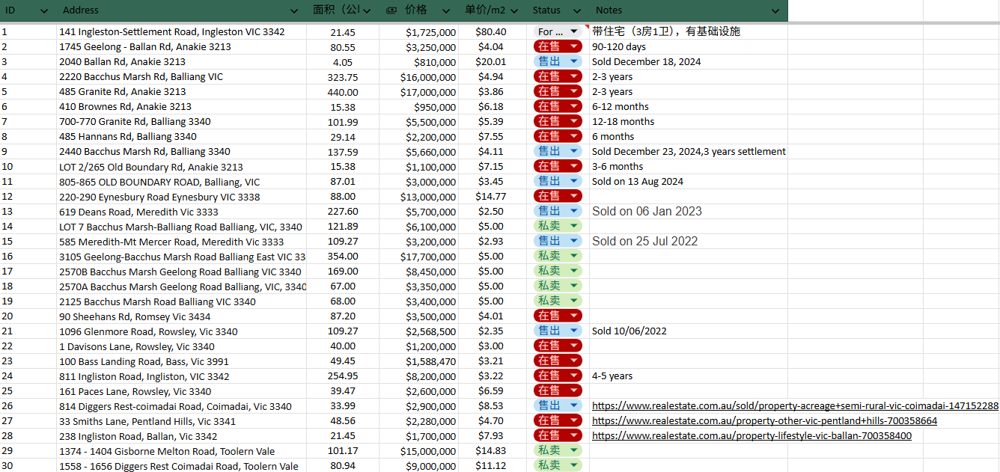
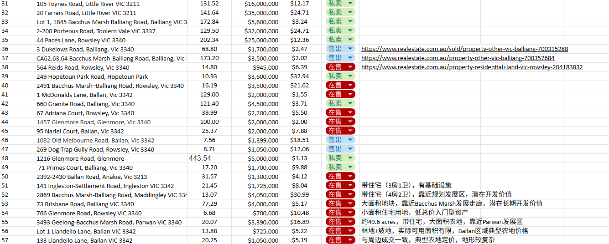
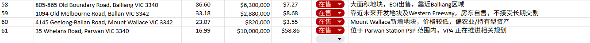

## 动态

### Parwan Employment Precinct（PEP）规划取得新进展

本月，Victorian Planning Authority（VPA）公布了最新的 **Parwan Employment Precinct Project Status Update**，显示该项目正持续推进，并已进入更深入的规划阶段。

根据最新公布的信息，VPA 目前正重点开展以下工作：

- 持续完善 Draft Place Based Plan 及 Precinct Structure Plan（PSP）；
- 完成土地利用、交通、经济、环境、水资源、公用设施及综合基础设施等多项技术研究；
- 与 Greater Western Water 持续讨论未来再生水供应方案；
- 与土地业主、相关政府部门及各专业机构持续进行协调沟通。

相比过去两年因濒危物种调查而导致规划进度放缓，目前项目已经恢复正常推进，并进入实质性的规划准备阶段。虽然距离正式公示及最终批准仍需要一定时间，但整体方向已经更加明确。

对于我们项目而言，我认为这是一个积极的信号。Parwan Employment Precinct 属于我们农场北侧最重要的长期规划项目之一，其持续推进代表政府仍然维持对该区域未来产业及就业发展的长期规划方向。虽然短期内不会对土地价值产生直接影响，但随着各项基础研究逐步完成，未来进入正式 PSP 公示及审批阶段的可能性正在逐步提高，值得持续关注。

### Moorabool Shire Council 发布 Year 1 Update

本月 Moorabool Shire Council 发布了《Council Plan 2025–2029 Year 1 Update》。报告再次确认，Moorabool 仍将维持快速人口增长趋势，预计未来二十年人口将接近翻倍。

Council 认为，未来几年的重点工作将围绕基础设施建设、公共服务及地方经济发展展开，为人口持续增长做好准备。同时，Council 继续将“建立具有韧性的地方经济”列为核心目标之一，明确支持农业、产业投资及区域就业的发展。

从整体方向来看，政府对于 Moorabool 的长期发展定位没有发生改变，仍持续朝着人口增长、产业发展及基础设施同步完善的方向推进。

Council 在 Year 1 Update 中再次强调，**Moorabool 是维州增长最快的半农村地区之一**，人口预计将由目前约 **4万人** 增长至 **2046年的约7.3万人**。同时，Council 认为未来几年最大的挑战将是如何在快速增长的同时，提供足够的基础设施和公共服务。

## 周边土地市场

### 新上市的地块

### 编号：60

地址：4145 Geelong-Ballan Road, Mount Wallace, Vic 3342  
面积：23.07 公顷  
报价：约 $820,000  
单价估算：约 **$3.55/m²**  
状态：在售

**初步点评：**  
该地块位于 Mount Wallace，靠近 Geelong-Ballan Road，价格明显低于近期 Ballan / Balliang 周边带发展预期地块，单价约 $3.55/m²，更接近传统农业或长期持有型资产定价。

### 编号：61

地址：35 Whelans Road, Parwan, Vic 3340  
面积：16.99 公顷  
报价：约 $10,000,000  
单价估算：约 **$58.86/m²**  
状态：在售

**初步点评：**  
位于 Parwan Station PSP 范围内，VPA 正在推进相关规划，属于未来开发预期型资产，挂牌价格主要反映未来土地开发价值，而非农业用途价值。

### 编号：55

- **地址：3493 Geelong-Bacchus Marsh Road, Parwan, VIC 3340**
- **面积：约20.07公顷（49.6 Acres）**
- **原记录价格：$3,390,000**
- **最新价格：$2,900,000**
- **状态：在售**

- **原价格：$3,390,000**
- **最新价格：$2,900,000**
- **降价：$490,000**
- **降幅：约14.5%**

### 更新后的单价

- **$2,900,000 ÷ 200,700 m² ≈ $14.45/m²**
- **原单价约 $16.89/m²**

### 本月成交情况

本月未发现具有代表性的大面积农业土地成交案例。
