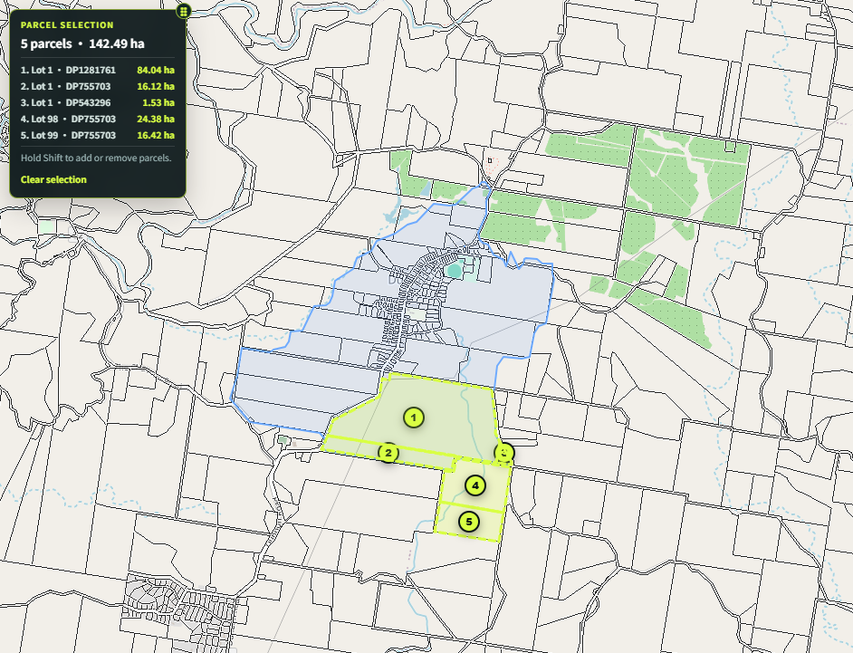
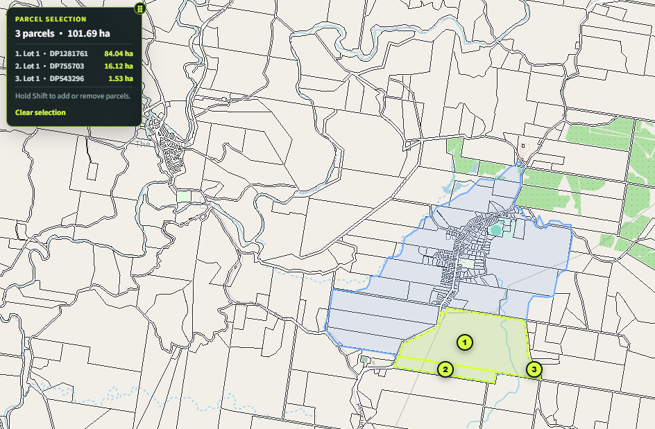

**日期：2026年9月**  
**用途：股东内部讨论 / 投资决策参考**  

---

## 1. 项目现状

项目位于 NSW Lismore City Council 辖区 Dunoon，现状为一处约 **142.48公顷的夏威夷果农场**。

- **土地总面积：**约 142.49 ha
- **未来增长区面积：**约 101.69 ha，占项目总面积约 **74%**

- **其余农业用地：**约 41 ha
- **本次收购价格：**A$8.0m，另加 NSW Stamp Duty
- **历史估值：**2019 年 Herron Todd White 正式估值报告的 “As Is” Market Value 为 **A$6.765m（ex GST）**。
- **农业经营：**目前夏威夷果经营盈利能力较弱，本项目的投资逻辑不以农业利润增长作为主要收益来源。

### 加工厂安排

据项目方提供，刘总于去年底投入约 **A$4.0m** 建设夏威夷果加工厂。加工厂 **不纳入本次土地收购范围**：

- 占地约 **3,000㎡（0.3 ha）**；
- 后续拟通过产权分割，将相关土地单独归属于加工厂公司；
- 农场持有期间，刘总现有夏威夷果团队及加工厂团队继续负责日常农业经营和资产管理。

> **交易文件需重点确认：**加工厂地块分割、出入口、供水供电、排污、通行权及相关 easement，避免未来开发时形成产权或基础设施障碍。

---

## 2. 当前规划位置

Lismore City Council 已于 **2026年9月8日** 通过新的 Strategic Planning Framework。Dunoon 被明确列为未来 Village Growth Area，整个增长区约 **362 ha**，战略层面预期约 **434套住宅**。

本项目约 101.69 ha 位于该增长区内，占整个 Dunoon Growth Area 约 **28%**，即接近三成，因此属于区域内具有较大影响力的单一地块。

需要区分两个阶段：

1. **已完成：Council 层面的 Strategic Planning Framework adoption**；
2. **下一步：NSW State Government / DPHI endorsement**。目前假设为 **3–6个月**，该时间并非公开法定承诺，将由我们直接与州政府及 Council 进一步确认。

---

## 3. 规划推进时间线

| 阶段 | 当前工作假设 | 核心价值变化 |
|---|---:|---|
| **① Council Strategic Framework 已通过** | 已完成 | 土地已从纯农业资产进入明确的未来增长框架 |
| **② NSW State endorsement** | 约3–6个月 | 州级战略确认，进一步降低规划方向风险 |
| **③ Dunoon Master Plan** | 预计约12个月 | 明确道路、密度、污水、开放空间及土地布局；这是项目最关键的增值阶段 |
| **④ Planning Proposal / Gateway / LEP Rezoning** | 预计其后约12–24个月 | 将战略规划转化为法定住宅开发权 |
| **⑤ Subdivision / Eco-village DA** | 可提前并行准备技术工作，最终审批受 rezoning 进度制约 | 形成可直接出售给开发商的 permit-ready / DA-approved 项目 |

### 基准退出周期

- **3年计划：**目标做到 Master Plan 落定，并进入或取得 Gateway / Rezoning 关键节点；
- **5年计划：**原则上完成 Rezoning 及 DA 后退出；
- **公司不计划自行进入 civil works 或住宅建设。**

---

## 4. 收购价格与农地价值比较

A$8.0m 对应约 140 ha，名义收购单价为：

**A$57,143/ha = A$5.71/㎡**

### Dunoon 周边近期农村物业成交参考

| 地址 | 成交时间 | 面积 | 成交价 | 折合约 A$/㎡ |
|---|---:|---:|---:|---:|
| 38 May Street, Dunoon | 2024 | 26.75 ha | A$1.388m | **5.19** |
| **本项目** | 2026 | ~140 ha | **A$8.0m** | **5.71** |
| 66 Fraser Road, Dunoon | 2024 | 32.10 ha | A$1.995m | **6.21** |
| 1239 Dunoon Road, Dunoon | 2024 | 42.20 ha | A$2.980m | **7.06** |
| 186 Missingham Road, Dunoon | 2025 | 15.52 ha | A$1.380m | **8.89** |

> 上述交易均为农村/生活方式物业，部分包含住宅、果园及其他改善物，因此不能作为纯土地估值直接套用；其意义在于说明本项目 **A$5.71/㎡ 的整体买入价格仍处于当地农村资产价格区间的低端附近**，而约四分之三土地已经进入未来增长区。

### 名义单价对比图

```text
A$/㎡
38 May Street       █████                 5.19
本项目              ██████                5.71
66 Fraser Road      ██████                6.21
1239 Dunoon Road    ███████               7.06
186 Missingham Rd   █████████             8.89
```

### 核心防守逻辑

本项目最重要的特点并不是以成熟开发地价格收购，而是：

> **以接近当地农村土地的价格，取得一项约74%–75%土地已经进入未来住宅增长框架的资产。**

因此，即使规划推进速度低于预期，土地仍有农业/农村资产价值作为一定程度的底层支撑；而每完成一个规划里程碑，都存在重新定价和提前退出的机会。

---

## 5. 密度是项目价值的核心变量

Council 对整个 Dunoon Growth Area 的战略预期为 **362 ha / 434 homes**。若简单按面积平均分配，本项目 103–105 ha 对应约：

**125套左右住宅**

这应视为目前的 **保守规划基准**，而不是我们的最终目标。

### 我们的规划目标

项目拟以 **Eco-village** 为核心概念，与 Council / State Government 推进更高效的土地利用及污水处理方案，包括：

- 住宅以较小地块集中布置；
- 通过 cluster / precinct 方式组织住宅；
- 采用 communal wastewater / 集中式小型污水处理系统，降低传统公共 sewer 的制约；
- 保留大面积开放空间、生态空间及公共设施；
- 在不显著增加区域基础设施负担的前提下，提高住宅 yield。

现阶段建议股东采用两档判断：

| 情景 | 住宅数量 | 定位 |
|---|---:|---|
| **保守基准** | ~125套 | 按 Council 当前整体战略密度比例推算 |
| **第一阶段规划目标** | ~200套 | 通过 Eco-village、污水方案及 Master Plan 协商争取更高密度 |

**从125套提升至约200套，是我们参与项目后最重要的主动价值创造工作。**

---

## 6. 规划节点与指示性退出价值

以下仅作为内部投资模型，采用 **2026年当前市场价值口径**，不假设未来房价上涨；实际价值最终取决于 Master Plan 密度、基础设施成本、市场环境及开发商风险偏好。

| 阶段 | 主要条件 | 指示性整体项目价值 |
|---|---|---:|
| **当前收购** | Strategic Framework 已通过 | **A$8.0m** |
| **State endorsement** | 州政府完成战略认可 | **A$8.5m–9.5m** |
| **Master Plan — 约125套** | 保守密度得到确认 | **A$10.5m–12.5m** |
| **Master Plan — 约200套** | Eco-village / higher density 获原则接受 | **A$12.5m–15.0m** |
| **Gateway / Rezoning 关键阶段 — 约200套** | 法定 rezoning 路径大幅去风险 | **A$15m–20m** |
| **DA Approved — 约200套** | 形成可直接交由开发商实施的项目 | **A$18m–23m** |

### 估值理解

项目价值不会因为单一“盖章”立即大幅跳升。真正的价值释放主要来自两个节点：

1. **Master Plan 明确可实现的住宅密度；**
2. **Rezoning / DA 将规划可能性转化为法定开发权。**

因此，项目的管理重点不是等待市场自然上涨，而是主动缩短规划时间并提高可确认的住宅 yield。

---

## 7. 投资结构及资金投入

拟由我方取得 **50%–60% 控股权益**，其余 **40%–50%** 由刘总及其团队持有，并可能包括 Wenny。

按 2026/27 NSW 一般 Transfer Duty 计算，A$8.0m 收购价格的 Stamp Duty 约为 **A$0.421m**，因此仅计土地及印花税的初始投资约为：

**A$8.421m**

| 我方持股比例 | 我方对应土地价 | 按比例承担土地+一般Stamp Duty | 其他股东方对应投入 |
|---:|---:|---:|---:|
| **50%** | A$4.00m | **约A$4.21m** | 约A$4.21m |
| **55%** | A$4.40m | **约A$4.63m** | 约A$3.79m |
| **60%** | A$4.80m | **约A$5.05m** | 约A$3.37m |

> 上表未包括律师、尽调、规划顾问、工程顾问、利息、Land Tax及后续DA等费用；最终资金安排应以实际股权结构及融资方案为准。

### 双方角色分工

**刘总及原团队**
- 继续负责夏威夷果农场日常经营；
- 管理现有人员及农业资产；
- 加工厂作为独立业务运营，不纳入本次开发投资收益模型。

**我方**
- 控股并负责项目战略；
- 主导 Council / State Government 沟通；
- 推进 Master Plan、Eco-village及更高密度方案；
- 协调 town planner、wastewater、traffic、ecology 等专业顾问；
- 根据不同规划里程碑组织市场测试及退出。

双方的能力具有互补性：原团队提供土地、农业经营及本地资产管理能力，我方重点补足 **规划推进、政府沟通及开发价值实现**。

---

## 8. 核心机会与主要风险

### 核心机会

**第一，买入价格具有较好的防守性。**  
项目名义收购单价约 A$5.71/㎡，与周边农村物业成交水平接近，而约74%–75%的土地已经被划入未来增长区。

**第二，项目在 Dunoon Growth Area 中占比较大。**  
项目约占整个增长区 **29%**，属于区域规划中不可忽视的主要土地持有者，有条件在 Master Plan 阶段进行持续、系统的政府沟通。

**第三，存在多个退出节点。**  
State endorsement、Master Plan、Gateway、Rezoning、DA 均可能形成不同程度的价值重估，不必将投资锁定到最终开发阶段。

**第四，密度提升具有显著价值弹性。**  
125套是保守基准，第一阶段目标约200套。若 Master Plan 最终接受更高密度，项目价值将显著高于单纯按照区域平均密度的土地价值。

### 主要风险

**1. 时间风险 — 最重要的风险。**  
任何 State endorsement、Master Plan、Gateway、Rezoning 或 DA 延期，都会增加持有成本并降低年化回报。管理重点是尽早确认政府内部时间表、持续跟进并提前准备技术材料。

**2. 密度风险。**  
最终住宅数量取决于 Council / State 对污水、道路、生态、开放空间及基础设施的综合判断。我们可以通过规划设计和政府沟通管理这一风险，但不能完全消除。

**3. 基础设施与污水风险。**  
Eco-village 的核心价值之一是解决传统 sewer 难题，但 communal wastewater 的技术方案、长期运营责任及审批条件必须在 Master Plan 阶段尽早验证。

**4. 市场风险。**  
当前住宅及开发土地市场并不处于强势周期。项目预计退出窗口为未来约3–5年，因此市场存在恢复机会，但本投资模型 **不以未来房价上涨作为基础假设**。如果市场改善，则作为额外 upside；如果市场仍弱，则主要依靠 planning uplift 创造退出价值。

**5. 加工厂产权分割风险。**  
约3,000㎡加工厂地块未来独立产权安排必须在交易文件中明确，并解决长期 access、services 和 easement 问题。

---

## 9. 建议的退出策略

本项目原则上不进入实际住宅开发阶段，而采取 **“规划增值 + 阶段退出”** 模式。

### 3年目标

争取完成 Master Plan，并进入 Gateway / Rezoning 的关键阶段。届时对外进行 Developer EOI 或 off-market market test：

- 如市场已充分反映规划增值，可提前退出；
- 如报价仍明显低于后续 DA 价值，则继续持有。

### 5年目标

原则上完成 Rezoning 及 DA，并将项目作为 **DA-approved / permit-ready development site** 出售给专业开发商。

### 管理原则

> **不以“必须持有满5年”为目标，而以每一个规划节点后的风险收益比作为退出依据。**

当某一阶段市场愿意支付足够的去风险溢价时，即可实现退出，不需要承担后续 civil construction 和住宅销售风险。

---

## 10. 股东需要重点关注的四个指标

1. **State endorsement 是否按3–6个月工作假设推进；**
2. **Master Plan 是否能在约12个月的工作假设内形成，并确认项目的可开发面积；**
3. **住宅密度能否由约125套提高至第一阶段目标约200套；**
4. **每个规划节点的市场报价是否已经达到合理退出水平。**

### 项目一句话总结

> **本项目的核心投资逻辑，是以接近当地农村资产的价格取得一块约四分之三土地已进入未来住宅增长框架的140公顷资产，通过Master Plan、Eco-village及政府沟通提升住宅密度，在3–5年的规划去风险过程中择机出售，而不承担最终住宅开发风险。**

---

## 资料来源及口径说明

- Lismore City Council, *Council Adopts Landmark Lismore 60000 Framework to Guide Future Growth*, 14 Sep 2026.
- Lismore City Council, Strategic Planning Framework meeting materials, 8 Sep 2026.
- Herron Todd White, *Valuation Report – 1306 Dunoon Road, Dunoon*, 26 Aug 2019. 正式结论：“As Is” Market Value A$6.765m ex GST；报告面积 142.95 ha。
- Revenue NSW, 2026/27 Transfer Duty rates：A$8.0m dutiable value 按一般税率测算约 A$421,287。
- Realestate.com.au / Domain 成交记录：38 May Street、66 Fraser Road、1239 Dunoon Road、186 Missingham Road, Dunoon。
- 本报告中的 3–6个月 State endorsement、约12个月 Master Plan 及后续阶段时间均为现阶段管理层工作假设，并非 Council 或 NSW Government 的法定完成承诺，需继续通过官方沟通确认。
