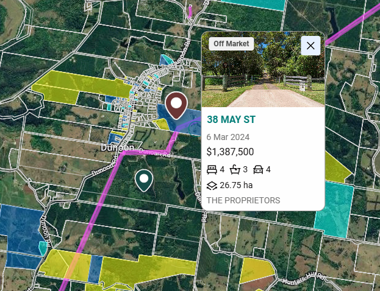

# 

这次去Dunoon和Lismore，主要目的不是简单看一下农场，而是希望把这个项目几个最重要的问题在现场尽量搞清楚：

**第一，这块地未来到底能不能做住宅开发；**  
**第二，大概什么时候可以做；**  
**第三，未来可能做成什么样；**  
**第四，开发成本和最终价值大概是什么水平；**  
**第五，如果我们决定参与，应该怎么和刘总合作。**

这几天分别和市政府规划部门、当地规划师、地产中介、附近地主、农业专业人员、农场管理人员以及刘总进行了比较深入的沟通。

经过这次考察，我对这个项目的理解比之前清晰了很多。

---

## 1. 这次接触的人比较全面，得到的信息基本可以互相验证

这次主要见了：

- Lismore市政府负责战略规划和开发审批的人员；
    
- 当地规划师；
    
- 1055 Dunoon Road项目的业主Brian；
    
- Century 21和Ray White两家当地中介；
    
- 农场经理；
    
- 农业方面的专业人员；
    
- 项目附近两位比较大的地主；
    
- 刘总。
    

所以这次得到的信息不是单纯来自卖方或者中介，而是分别从：

**政府、规划、市场、农业、周边地主和现有业主**

几个不同角度进行了验证。

---

## 2. 最大的收获，是基本确认Dunoon未来发展住宅的大方向已经比较明确

去之前，我最大的担心还是：

> 这块地所谓“未来住宅发展区”，到底只是一个很长期的概念，还是政府真的准备往前推进？

这次和市政府开完会以后，我认为这个问题已经清晰很多。

市政府目前确实需要解决未来住房供应的问题，而且Dunoon已经被纳入未来增长区域。

市政府目前讨论的整体方向，是未来Dunoon大约增加**400套左右住宅**。

我们这块地约142公顷，其中约**101.69公顷已经进入未来住宅发展范围**。

所以现在最大的风险已经不再是：

> **“这里未来到底会不会发展住宅？”**

而更多变成：

> **“最终允许做多少户、什么时候能做、需要什么基础设施。”**

这是我这次考察以后最大的一个判断变化。

---

## 3. 整个规划路径已经基本看得清楚

目前大致路径是：

**州政府确认 → Dunoon总体规划 → 土地正式变更用途 → 开发申请 → 开发建设**

市政府目前预计在州政府确认以后，开始推进Dunoon的总体规划。

这个总体规划会真正决定几个最重要的问题：

- Dunoon未来可以增加多少住宅；
    
- 哪些土地可以开发；
    
- 每块住宅用地最小做多大；
    
- 道路怎么走；
    
- 污水怎么解决；
    
- 哪些地方需要保留绿地；
    
- 商业和公共设施放在哪里。
    

所以未来一两年真正决定这块地价值的，并不是农场今年能产多少夏威夷果，而是**Dunoon总体规划最后怎么定。**

---

## 4. 我们不是只能坐在那里等政府做规划

这次市政府明确表示，在制定Dunoon总体规划的过程中，会和当地地主及相关人员进行沟通。

土地业主可以：

- 提交自己的初步开发方案；
    
- 参加相关讨论；
    
- 对道路、住宅密度、污水、公共设施等提出意见。
    

这点对我们非常重要。

因为我们这块地面积很大，在整个Dunoon未来住宅区域里面占有相当大的比例。

所以如果我们最终参与这个项目，我们应该尽早介入，而不是等政府把所有东西全部定完以后再开始研究。

我们的目标应该是：

> **在总体规划形成之前，就把我们希望的开发方案准备出来，主动参与整个规划过程。**

---

## 5. 1055 Dunoon Road是一个非常重要的现实案例

Brian的1055项目对我们很有参考意义。

他大约在2022年以**360万澳元**买入土地。

之后用了大约四年时间推动规划。

现在随着土地规划条件发生变化，市场对这块地的价值判断已经发生了非常大的变化，目前对外出售的预期价格已经达到很高的水平。

当然，我们不能简单认为：

> “他涨了多少倍，我们也一定涨多少倍。”

两块地的面积、位置、开发条件都不一样。

但这个案例至少证明了一件事：

> **Dunoon农业土地因为住宅规划发生价值重估，并不是一个理论故事，而是已经真实发生。**

所以这个项目真正创造价值的方式，不是靠种夏威夷果，而是靠**规划变化带来的土地升值。**

---

## 6. 周边地主已经知道土地未来会升值，所以便宜收地的机会正在减少

这次我们也直接接触了附近两个比较大的地主。

其中Marie大约有**26公顷**，她已经知道未来规划变化，所以目前既不想开发，也不想卖，就是准备继续拿着。

  

  

另外一个地主Gudi大约有**40公顷**。

他的地两年前大约想卖400万澳元，当时有人出到330万左右，没有成交。

现在他也已经知道未来住宅规划的事情，所以他的想法也是：

> 等政府把未来能做多少住宅确定以后，再决定卖不卖。

这个现象很重要。

说明Dunoon现在正处在一个比较特殊的阶段：

> **大家已经知道土地未来可能升值，但是最终能升多少还没有确定。**

换句话说：

**规划价值已经开始被市场认识，但还没有完全反映到土地价格里面。**

这也是为什么现在这个时间点值得认真研究。

---

## 7. 这次现场看完以后，我对未来产品的理解也发生了变化

一开始我们比较容易按照普通城市住宅开发的思路来算：

比如500平方米、600平方米、800平方米一块地。

但这次现场看完以后，我认为Dunoon不应该做成普通城市新区。

它更适合的是：

- 2,500平方米甚至更大的住宅地；
    
- 比较低密度；
    
- 保留乡村环境；
    
- 房子之间有比较大的距离；
    
- 有自然景观和绿地；
    
- 让买家既有乡村生活方式，又有基本的城镇配套。
    

所以未来卖的其实不只是土地面积。

真正的产品应该是：

> **一种靠近Byron Bay、Bangalow和Lismore的北部河流地区乡村生活方式。**

这也决定了我们的开发方式和普通城市住宅项目会非常不一样。

---

## 8. 当地已经有非常好的参考项目

我们重点研究了Dunoon当地已经开发完成的Avondale，以及旁边Donaghue Street的历史开发项目。

这些项目证明：

Dunoon过去已经允许过：

- 2,000—4,000平方米甚至更大的住宅地；
    
- 每户自己解决污水；
    
- 接城镇供水；
    
- 地下供电；
    
- 比城市住宅区更简单的道路；
    
- 比城市住宅区更少的人行道和公共设施。
    

这一点非常重要。

因为这意味着我们现在设想的：

> **大地块住宅 + 每户自己处理污水**

不是我们自己想出来的概念。

Dunoon当地本身就有类似的实际案例。

---

## 9. 我现在认为180户这个假设并不激进

我们进入未来住宅范围的土地大约是：

**101.69公顷。**

如果做180户，相当于平均每一户占用：

**约5,650平方米的总土地。**

这里面已经包括：

- 住宅地；
    
- 道路；
    
- 排水；
    
- 绿地；
    
- 环境保护区域；
    
- 公共设施等。
    

如果最终每块实际出售的住宅地平均做2,500—3,500平方米，从纯土地面积来看，180户并不算密。

所以现在真正决定最后能不能做180户的，不是土地够不够，而是：

1. 政府最后允许的住宅密度；
    
2. 污水处理要求；
    
3. 环境限制；
    
4. 道路和基础设施要求。
    

---

## 10. 开发成本可能没有我们一开始想得那么高

我们之前为了保守，曾经按照：

**每户20万澳元**

估算开发成本。

但这次现场考察和研究当地实际项目以后，我认为20万作为基础假设可能过于保守。

原因是这种乡村小镇的大地块开发，不一定需要普通城市住宅项目里面那么完整的：

- 集中污水管网；
    
- 宽的城市道路；
    
- 大量人行道；
    
- 大量路灯；
    
- 大规模景观工程；
    
- 每块土地全面整平。
    

当地历史项目已经证明，一些内部道路可以采用比较简单的标准。

所以目前我认为比较合理的三个成本假设是：

- **每户10万澳元：比较顺利的情况**
    
- **每户12—14万澳元：目前比较合理的基础假设**
    
- **每户17—20万澳元：出现重大外部道路、供水、污水等额外工程**
    

这个数字非常重要。

例如180户：

每户20万和每户12.5万之间，

总开发成本相差大约：

**1,350万澳元。**

所以接下来必须把开发成本真正一项一项算清楚。

---

## 11. 污水处理可能是整个项目经济性最关键的问题之一

Dunoon现在没有完整的城市污水管网。

当地过去的大地块住宅项目，采用的是：

> **每户自己安装污水处理系统。**

如果未来总体规划仍然允许这种方式，那么对我们非常有利。

因为开发商就不需要自己建设一整套大型集中污水系统。

而且每户的污水处理设备，可以由未来买地建房的人自己承担。

这样可以明显减少我们的前期开发投入。

所以接下来非常重要的一个问题就是：

> **政府最后允许多大的住宅地继续采用每户独立污水处理。**

这个答案会直接影响开发密度和开发成本。

---

## 12. 农场本身已经不应该作为这个项目的主要投资逻辑

和刘总谈完以后，这一点更加明确。

过去两年夏威夷果经营非常差。

正常情况下，这几处农场一年应该生产500—600吨以上。

但2025年实际只有大约100—140吨。

结果就是：

- 农业投入没有明显下降；
    
- 产量大幅下降；
    
- 果实质量下降；
    
- 销售价格下降；
    
- 同时还要承担银行利息。
    

2025年整个项目大约消耗了接近**300万澳元现金**。

所以继续把这个项目理解成：

> “买一个夏威夷果农场，靠农业赚钱”

已经没有太大意义。

未来农业最大的作用应该是：

> **在等待土地规划的几年里面，尽量减少持有成本。**

能出租就出租，能让别人承担农业经营成本就让别人承担。

我们真正关注的应该是土地本身。

---

## 13. 刘总现在的思路其实也已经从“经营农场”转向“处理资产”

刘总目前已经开始改变策略：

以前是：

> 所有农场继续经营，希望靠农业恢复。

现在逐渐变成：

> **停止亏损 → 出租或出售价值较低的农场 → 偿还银行贷款 → 保留真正有开发潜力的土地。**

我认为这个方向是合理的。

因为现在整个公司最大的问题并不是没有资产，而是：

**债务比较重，同时农业每年还在消耗现金。**

如果未来能把其他价值较低的农场逐步出售，用来降低银行贷款，而把LDR1这种真正有开发潜力的资产留下来，整个项目的风险会下降很多。

---

## 14. 所以我们不能简单按照“800万买一个农场”来判断这笔交易

如果只是一个140多公顷的夏威夷果农场，我不会认为800万澳元有特别大的吸引力。

但是现在我们买到的实际上是两个东西：

### 第一部分

一个现有的农业土地资产。

### 第二部分

约101.69公顷未来住宅发展土地所包含的开发机会。

所以真正应该问的问题不是：

> “这个农场值不值800万？”

而应该是：

> **“我们愿意花多少钱，去获得这101.69公顷未来住宅开发机会？”**

如果未来规划逐步确定，土地价值的判断方式会完全改变。

---

## 15. 现在最大的机会是什么

我认为目前最大的机会主要有几个：

第一，土地目前还没有完全按照未来住宅开发价值定价。

第二，约101.69公顷已经进入未来住宅发展范围。

第三，市政府确实有增加住房的需求。

第四，我们的土地规模很大，有机会主动参与未来总体规划。

第五，当地已经存在类似的大地块住宅开发案例。

第六，如果未来允许每户自己解决污水，开发成本可能明显低于普通城市住宅项目。

第七，1055项目已经证明，规划变化确实可以给当地土地带来非常大的价值提升。

---

## 16. 现在最大的风险是什么

同时，这个项目还远远没有到“确定赚钱”的阶段。

目前几个最大的风险仍然是：

### 第一

最后到底允许做多少户，还没有确定。

### 第二

未来每块住宅地最小面积是多少，还没有确定。

### 第三

是否可以继续采用每户独立污水处理，还没有最终确定。

### 第四

环境保护、地形、排水等因素到底会损失多少可开发土地，还需要进一步研究。

### 第五

市政府是否会要求我们承担比较大的外围道路、供水或者其他基础设施升级，还不知道。

### 第六

未来2,500—5,000平方米的住宅地到底能卖多少钱、每年能卖多少块，还需要进一步验证。

### 第七

整个规划过程到底需要三年、五年还是更长，目前仍然存在时间风险。

所以现在不能按照一个已经批准的住宅开发项目去估值。

---

## 17. 这次考察以后，我对这个项目的总体判断

我的信心比出发之前有所提高。

但不是因为风险消失了。

而是因为：

> **原来很多完全不知道的问题，现在已经开始变成可以具体研究、计算和解决的问题。**

去之前我们最大的疑问是：

> **“Dunoon到底会不会发展？”**

现在这个问题已经相对清晰。

接下来真正要解决的是：

> **“能做多少、什么时候能做、需要花多少钱、最后能卖多少钱。”**

如果这四个问题能够逐渐得到答案，这个项目就可以真正进入投资决策阶段。

---

# 18. 下一步最重要的工作

接下来我认为不需要再做大量泛泛的研究，而应该集中解决几个直接影响投资回报的问题：

1. 和规划师一起做第一版土地开发概念图；
    
2. 分别测试150户、180户、250户等不同方案；
    
3. 明确每户独立污水处理的可行性；
    
4. 初步确定道路、供水、供电和排水方案；
    
5. 把每户开发成本从头到尾算一遍；
    
6. 调查当地2,500—5,000平方米住宅地真实售价；
    
7. 研究每年市场能够消化多少块地；
    
8. 做三年、五年两个时间模型；
    
9. 计算土地在不同规划阶段的价值；
    
10. 最后再确定我们愿意用什么价格、什么合作方式参与这个项目。
    

---

# 最后一句话

如果让我用一句话总结这次考察后的判断：

> **这已经不是一个“要不要买夏威夷果农场”的项目，而是一个“能不能用相对低的农业土地价格，提前进入Dunoon未来住宅开发”的项目。**

接下来真正需要判断的，不是夏威夷果明年能不能赚钱，而是：

**未来住宅能做多少户、开发成本是多少、需要等多久，以及我们用什么方式参与，才能把风险控制在合理范围内。**