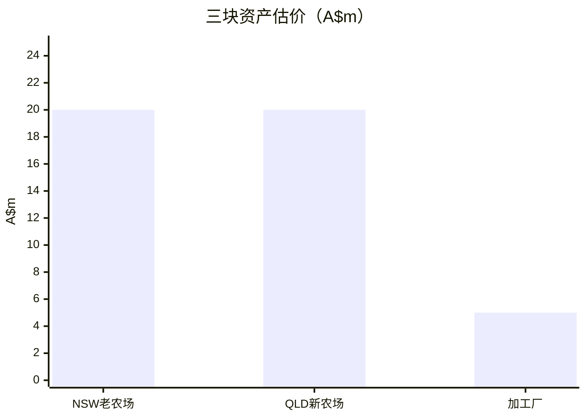
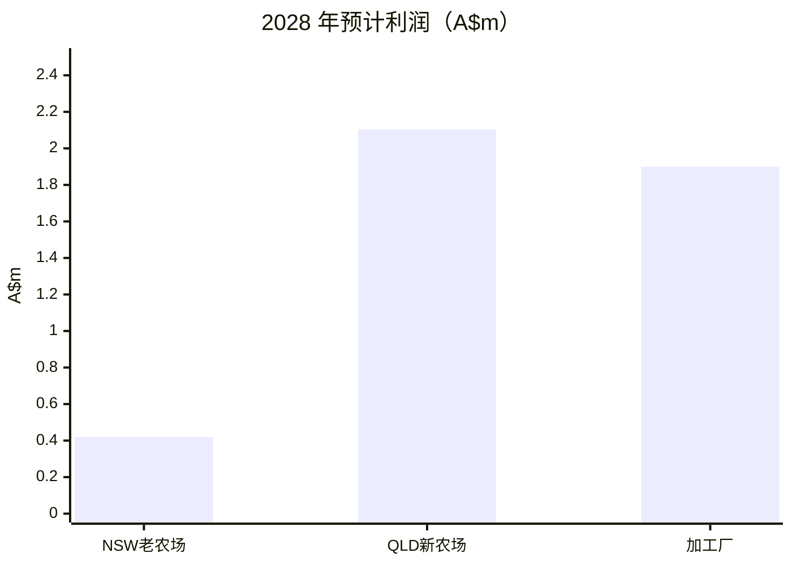
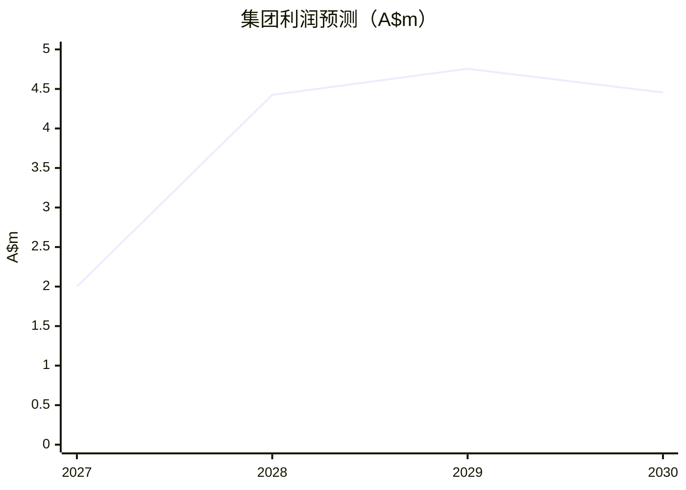

---
tags:
  - project
  - report
  - agriculture
  - finance
project: 夏威夷果农场
created: 2026-04-24
updated: 2026-04-27
source_files:
  - "[[10_Projects/夏威夷果农场/NSW老农场]]"
  - "[[10_Projects/夏威夷果农场/Qld新农场]]"
  - "[[10_Projects/夏威夷果农场/夏威夷果农场 - 三表汇总终稿]]"
  - "[[20_Knowledge/澳洲坚果/澳洲夏威夷果行业分析（2026）]]"
  - "[[20_Knowledge/澳洲坚果/夏威夷果农场估值基准]]"
  - "[[20_Knowledge/澳洲坚果/夏威夷果农场投资模型_100ha示例]]"
---

# 夏威夷果农场股东汇报

> 这个版本按目前讨论口径来做汇报测算：  
> **NSW老农场 A$20m，QLD新农场 A$20m，加工厂 A$5m**。  
> 总投资按 **A$45m** 计算。  
> **农场经营部分统一区分 Base Case（Current Market）和 Upside Case（Benchmark），避免把历史 benchmark 收入和当前 NIS 收购价混用。**

---

## 一、先说结论

这个项目可以分成三块来看：

1. **NSW老农场**：偏重组和处置，回报弱，重点是减压；
2. **QLD新农场**：是未来增长核心，后面几年会慢慢放量；
3. **加工厂**：现金流最稳定，是整个项目里最能赚钱的一块。

按我们现有模型，项目在 **2028–2030 年** 的年利润大致在 **A$4.425m 到 A$4.755m** 之间。

如果按 **40% 自有资金、60% 银行贷款、利息 7%** 来算，股东层面的年化回报率大约是 **14%–15%**。

### 本次汇报建议口径

- **Base Case / Current Market**：农场端按当前公开参考 **A$4.25/kg NIS** 做保守测算；
- **Upside Case / Benchmark**：农场端按历史高产组 benchmark，对应约 **A$6.04/kg**，用于展示成熟高产园上行空间；
- **加工厂模型**：仍按现有单体模型展示，但需单独说明其原料采购价假设与农场端未完全统一。

---

## 二、三块资产怎么拆

### 表 1：资产、投入、产出

| 资产 | 估价口径 | 投入 | 产出 |
|---|---:|---:|---:|
| NSW老农场 | **A$20m** | 购入较早，历史投入高，当前负债压力大 | 2027–2030 年利润约 **A$0.015m / 0.42m / 0.75m / 0.45m** |
| QLD新农场 | **A$20m** | 主要是建园和开发投入，后面还有放量空间 | 2027 年约 **A$0.985m**，2028 年后稳态约 **A$2.105m/年** |
| 加工厂 | **A$5m** | 设备、厂房、电力、加工线投入 | 单体模型净利润约 **A$1.904m/年** |

### 表 2：总盘子

| 项目 | 金额 |
|---|---:|
| NSW老农场 | A$20m |
| QLD新农场 | A$20m |
| 加工厂 | A$5m |
| **合计** | **A$45m** |

---

## 三、行业背景，简单说就是这几条

澳洲坚果行业这几年还是在扩张，但也比较看天气和管理。

最新公开数据大致是：

- 2025 年澳洲产量约 **43,800 吨**；
- 出口占比约 **72%**；
- 成熟园平均产量约 **3.0 t/ha**；
- 只有做到 **5 t/ha+**，利润才会明显拉开。

这说明一个问题：

> 澳洲坚果不是“买了地就赚钱”的生意，真正值钱的是树龄、水权、单产、出仁率和加工能力。

另外，农场经营收入在汇报时一定要区分：

- **Base Case**：按当前 NIS 价格约 **A$4.25/kg**；
- **Upside Case**：按历史高产组 benchmark，对应约 **A$6.04/kg**。

---

## 四、图表看得更直观

### 图 1：三块资产估价

### 图 2：2028 年预计利润

### 图 3：集团利润走势

---

## 五、按融资结构算回报

### 1）融资假设

| 项目 | 金额 |
|---|---:|
| 总投资 | **A$45m** |
| 自有资金 40% | **A$18m** |
| 银行贷款 60% | **A$27m** |
| 年化利率 | **7%** |
| 年利息 | **A$1.89m** |

### 2）股东层面回报

公式很简单：

**股东净收益 = 项目利润 - 年利息**

**股东年化回报率 = 股东净收益 ÷ 自有资金**

### 表 3：回报测算

| 年份 | 项目利润 | 年利息 | 扣息后净收益 | 股东回报率 |
|---|---:|---:|---:|---:|
| 2027 | A$2.000m | A$1.890m | **A$0.110m** | **0.6%** |
| 2028 | A$4.425m | A$1.890m | **A$2.535m** | **14.1%** |
| 2029 | A$4.755m | A$1.890m | **A$2.865m** | **15.9%** |
| 2030 | A$4.455m | A$1.890m | **A$2.565m** | **14.3%** |

### 3）稳态回报

2028–2030 三年平均利润约 **A$4.545m**。  
扣掉利息后，平均可给股东的收益约 **A$2.655m**。  

对应的年化回报率约是：

**A$2.655m ÷ A$18m = 14.8%**

---

## 六、股东最需要看的三件事

### 1）NSW老农场

这块不是增长资产，当前更像重组资产。

简单说就是：

- 现在回报不高；
- 负债压力要先处理；
- 能卖的非核心资产要尽快卖；
- 这块要先“减压”，再谈增值。

### 2）QLD新农场

这块是项目后面的增长点。

它的特点是：

- 前期建园投入已经下去；
- 现在还在爬坡期；
- 后面 3–5 年会逐步放量；
- 真正的利润会在成熟后体现出来。

### 3）加工厂

加工厂是整个盘子里最稳的一块。

按单体模型：

- 投资约 **A$5m**；
- 年净利润约 **A$1.9m**；
- 回报率很高；
- 对整个项目现金流帮助最大。

---

## 七、可以直接给股东的话

> 这个项目不能只看单个农场，要按三块资产一起看。  
> NSW老农场现在主要任务是减债和重组，QLD新农场负责未来增长，加工厂负责稳定现金流。  
> 农场经营端我们建议同时展示 **Base Case（当前 NIS 价格）** 和 **Upside Case（历史 benchmark）**：前者反映当前市场，后者反映成熟高产园上行空间。  
> 如果按目前 **A$45m** 的总盘子、**40% 自有资金 + 60% 贷款** 的结构来算，项目稳态年化回报率大约在 **14%–15%**。

---

## 参考文件

- [[10_Projects/夏威夷果农场/NSW老农场]]
- [[10_Projects/夏威夷果农场/Qld新农场]]
- [[10_Projects/夏威夷果农场/夏威夷果农场 - 三表汇总终稿]]
- [[20_Knowledge/澳洲坚果/澳洲坚果行业]]
- [[20_Knowledge/澳洲坚果/澳洲坚果农场估值模型]]

