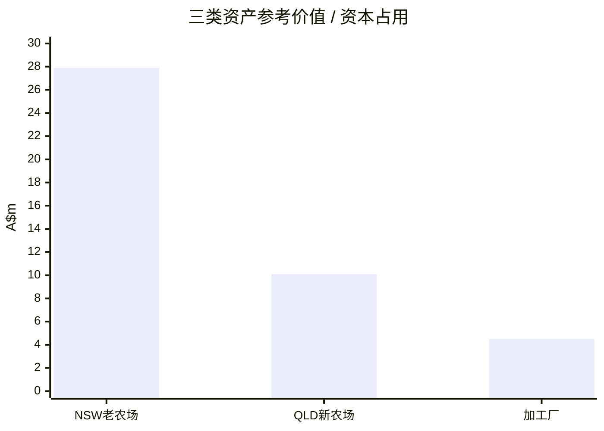
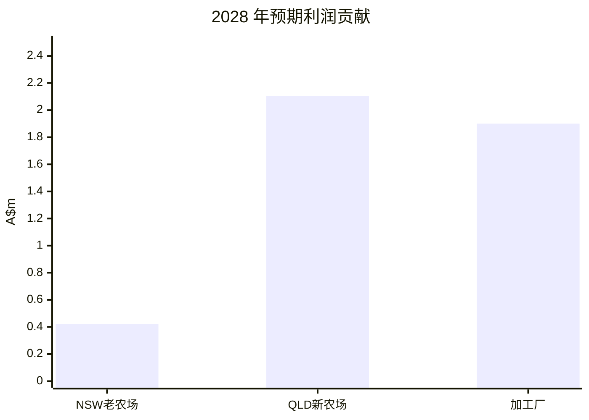

---
tags:
  - project
  - report
  - agriculture
  - finance
project: 夏威夷果农场
created: 2026-04-24
updated: 2026-04-24
source_files:
  - "[[10_Projects/夏威夷果农场/NSW老农场]]"
  - "[[10_Projects/夏威夷果农场/Qld新农场]]"
  - "[[10_Projects/夏威夷果农场/夏威夷果农场 - 三表汇总终稿]]"
  - "[[20_Knowledge/澳洲坚果/澳洲坚果行业]]"
  - "[[20_Knowledge/澳洲坚果/澳洲坚果农场估值模型]]"
---

# 夏威夷果农场股东汇报（简版）

> 目的：用一页到两页的篇幅，向股东说明三类资产的**当前定位、参考价值、投入与产出**。  
> 结论先行：本项目更适合按“**NSW老农场重组处置 + QLD新农场成长兑现 + 加工厂稳定现金流**”来理解。

---

## 一、结论摘要

项目的核心不是单一农场，而是三块资产的组合：

1. **NSW老农场（DM）**：问题资产，当前应以减债、重组、处置为主；
2. **QLD新农场（ZL）**：优质资产，处于产量爬坡与未来放量阶段；
3. **加工厂**：现金流资产，是组合中最稳定的利润引擎。

按集团口径，三块资产的利润贡献在 **2028–2030 年**大致为 **A$4.425m–4.755m/年**。

---

## 二、三块资产怎么分

### 表 1：资产分类、价值、投入、产出

| 资产 | 分类 | 参考价值 / 资本占用 | 主要投入 | 当前/未来产出 |
|---|---|---:|---:|---:|
| NSW老农场（DM新州） | 重组/处置资产 | 2019 年估值参考：**A$27.9m（As Is）** | 购入约 **A$17.5m**，外债约 **A$20m** | 2027–2030 利润约 **A$0.015m / 0.42m / 0.75m / 0.45m** |
| QLD新农场（ZL昆州） | 成长型优质资产 | 2022 年估值约 **A$10.1m** | 已完成大部分建园投入，仍有扩种空间 | 2027 利润约 **A$0.985m**；2028–2030 稳态约 **A$2.105m/年** |
| 加工厂 | 现金流资产 | 单体模型投资约 **A$4.5m** | 设备、厂房、电力、加工线投入 | 单体模型净利润约 **A$1.904m/年**；集团模型 2028–2030 约 **A$1.9m/年** |

---

## 三、行业背景：为什么这个组合成立

澳洲坚果行业最新公开数据表明：

- 2025 年澳洲产量约 **43,800 吨**；
- 出口占比约 **72%**；
- 成熟园平均产量约 **3.0 t/ha**；
- 只有做到 **5 t/ha+**，盈利才会明显放大。

这意味着：

- **单看农场土地，不足以判断价值**；
- **单看短期产量，也不足以判断未来利润**；
- 真正决定回报的是：**树龄、水权、单产、出仁率、加工能力和债务结构**。

---

## 四、图表：资产价值与利润贡献

### 图 1：三类资产的参考价值 / 资本占用（A$m）



> 注：NSW老农场取 2019 年历史估值基准；QLD新农场取 2022 年单体估值；加工厂取单体模型投资额。

### 图 2：2028 年预期利润贡献（A$m）



### 图 3：集团利润中枢（A$m）

```mermaid
xychart-beta
  title "集团总利润预测"
  x-axis ["2027", "2028", "2029", "2030"]
  y-axis "A$m" 0 --> 5
  line [2.0, 4.425, 4.755, 4.455]
```

---

## 五、股东最需要知道的三件事

### 1）NSW老农场不是增长资产

它当前更像**重组资产**：

- 经营端接近盈亏平衡，但一旦计入利息，仍偏弱；
- 适合通过出售非核心地块、减债、集中管理来改善；
- 不宜再按“高成长农场”估值。

### 2）QLD新农场是未来增长核心

它的价值不在今天的现金流，而在未来 3–5 年的放量：

- 190 ha 已种植，420 ha 土地，另有可扩种空间；
- 平均出仁率约 **44%**，优于 NSW 老农场；
- 2028 年以后有机会稳定贡献 **A$2.105m/年**。

### 3）加工厂决定组合的现金流稳定性

加工厂单体模型显示：

- 总投资约 **A$4.5m**；
- 年净利润约 **A$1.904m**；
- ROI 约 **42.3%**；
- 说明加工能力是整个项目最稳定的利润来源之一。

---

## 六、建议给股东的判断

**建议维持“重组 + 成长 + 现金流”的组合策略：**

- **NSW老农场**：以减债和处置优化为主；
- **QLD新农场**：继续持有，等待产量兑现；
- **加工厂**：作为核心现金流资产保留并强化。

如果三块资产按当前模型执行，项目利润结构会从“单纯依赖农场经营”逐步转向“**农场供给 + 加工增值 + 资产重组**”的组合模式。

---

## 七、最终一句话

> **NSW老农场负责减压，QLD新农场负责增长，加工厂负责现金流。**
> 这是当前最清晰、也最容易向股东解释的投资逻辑。

---

## 参考文件

- [[10_Projects/夏威夷果农场/NSW老农场]]
- [[10_Projects/夏威夷果农场/Qld新农场]]
- [[10_Projects/夏威夷果农场/夏威夷果农场 - 三表汇总终稿]]
- [[20_Knowledge/澳洲坚果/澳洲坚果行业]]
- [[20_Knowledge/澳洲坚果/澳洲坚果农场估值模型]]
