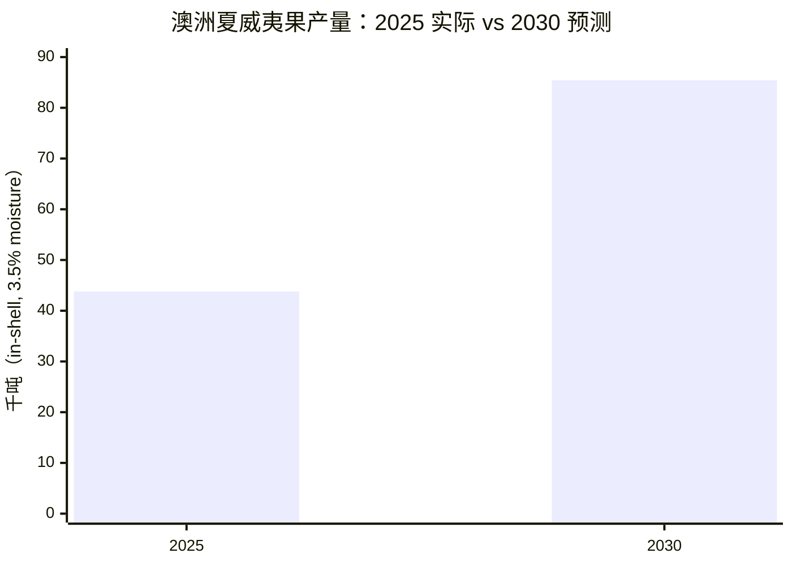
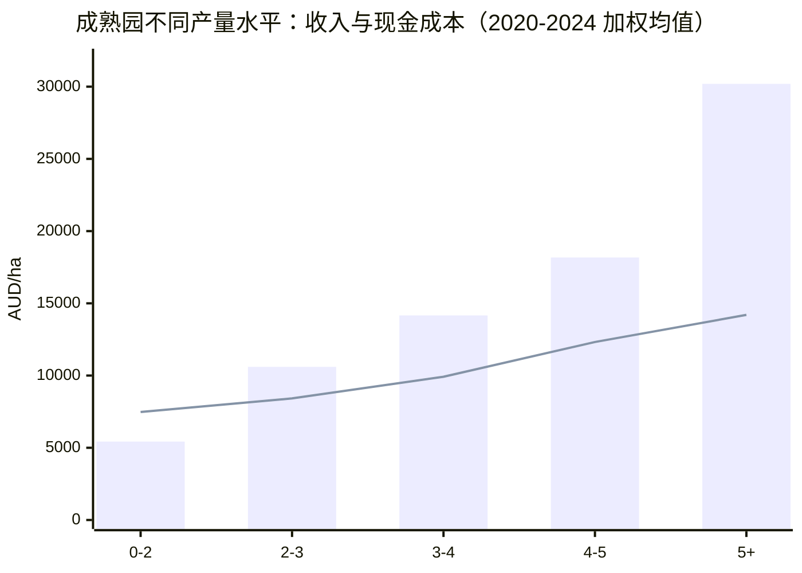

# 澳洲坚果（夏威夷果）行业分析（2026版）

> 适合：种植投资判断、行业研究、项目汇报
>
> 数据更新时间：**2026-04-24**
>
> 说明：本文结合你原来的“投资模型”笔记，并参考 Australian Macadamias 官网最新公开的 **Yearbook 2025、Benchmark Report 2024、2025 crop finalised、NRS 2024-2025、farm gate price factsheet** 等资料重写。

---

## 一句话结论

澳洲夏威夷果行业不是“看着产量就能赚钱”的行业，而是一个 **长周期、重管理、强依赖单产与品质** 的农业资产。

- **产量端**：2025 年澳洲收成 **43,800 吨**（in-shell，3.5% moisture），2030 年预测约 **85,440 吨**，接近翻倍。
- **市场端**：约 **72%** 产量出口，且澳洲仍是全球前三大 macadamia 产区之一。
- **经营端**：2024 年行业 benchmark 显示，成熟园平均产量约 **3.0 t/ha**；只有做到 **5 t/ha+**，盈利才会明显放大。
- **风控端**：2024-2025 National Residue Survey 继续确认了澳洲 macadamia 的高合规和食品安全形象。

**核心判断：** 这不是单纯的“买地种树”生意，而是一个“**先熬周期，再拼管理**”的行业。

---

## 1. 最新行业数据速览

| 指标 | 最新数据 | 备注 |
|---|---:|---|
| 2025 产量 | **43,800 吨** | in-shell，3.5% moisture |
| 2030 预测产量 | **85,440 吨** | in-shell，3.5% moisture |
| 已种植面积 | **46,487 ha** | 2025 年 11 月 |
| 产果面积 | **37,987 ha** | for the 2025 crop |
| 种植户数量 | **约 800** | 全国 |
| 出口比例 | **72%** | 2025 年季节 |
| 上一财年出口价值 | **A$275m** | 年鉴公开数据 |
| 2025 season farm gate price | **待发布** | 通常在次年 4 月下旬公布 |
| benchmark 样本 | **275 个农场** | 其中 231 个为 bearing farms |
| bearing farms 产量覆盖 | **31,519 吨** | 约占全国 **54%** |
| 5 年平均成熟园产量 | **3.0 t/ha** | 2020-2024 加权平均 |
| 高产组（5 t/ha+）毛利 | **A$15,994/ha** | 2020-2024 加权平均 |

---

## 2. 这个行业到底在发生什么？

### 2.1 供给端：行业在扩张，但天气会放大波动

澳洲 macadamia 的种植面积仍在增加。公开数据表明，2025 年澳洲已种植面积达到 **46,487 ha**，较上一年继续增长；其中可用于 2025 crop 的 bearing area 为 **37,987 ha**。

2025 年是一个典型的“**面积增长、产量受天气扰动**”年份：

- 2025 crop finalised 为 **46,940 吨**（10% moisture）或 **43,800 吨**（3.5% moisture）
- severe weather impacts 影响了所有主产区
- Northern NSW 和 Queensland 多地产量偏弱
- Bundaberg 反而继续扩张，成为最大产区之一

**结论：**
行业的长期趋势是扩产，但短期供给强烈受天气影响，所以不能把某一年的产量当成“稳定产能”。

---

### 2.2 市场端：出口是主战场，但澳洲内需也重要

根据 2025 Yearbook：

- 澳洲 macadamia 约 **72%** 出口
- 2024/25 年 kernel sales 整体 **+5.6%**
- in-shell sales 较前一年创纪录水平 **-15%**
- 国内 kernel 销售 **+1.7%**
- 海外市场表现分化：
  - 日本：**-0.9%**
  - 韩国：**+4.2%**
  - 美国：**-29.4%**
  - 德国：**+121%**
  - Other Europe：**+46.5%**
  - Other Asia：**+60%**
  - 台湾：**+31%**

这说明什么？

1. **澳洲 macadamia 不是单一市场依赖型产品**，而是多市场分散销售。
2. **高价值 kernel** 比单纯卖 in-shell 更能稳定现金流。
3. 出口结构正在从传统市场向更多欧洲、亚洲细分市场扩散。

---

### 2.3 经营端：这个行业的利润非常依赖单产

Benchmark Report 2024 的结论很直接：

- 成熟园 2024 年平均产量：**3.2 t/ha**
- 2020-2024 五年平均成熟园产量：**3.0 t/ha**
- 2024 年成熟园平均：
  - 收入：**A$10,573/ha**
  - 现金成本：**A$9,407/ha**
  - 毛利：**A$1,166/ha**
- 五年平均成熟园：
  - 收入：**A$12,529/ha**
  - 现金成本：**A$9,725/ha**
  - 毛利：**A$2,804/ha**

**更重要的是分组差异：**

| 产量分组 | 收入/ha | 现金成本/ha | 毛利/ha | 结论 |
|---|---:|---:|---:|---|
| 0–2 t/ha | A$5,427 | A$7,477 | **-A$2,050** | 明显亏损 |
| 2–3 t/ha | A$10,602 | A$8,417 | A$2,185 | 勉强可做 |
| 3–4 t/ha | A$14,162 | A$9,917 | A$4,246 | 进入正常盈利 |
| 4–5 t/ha | A$18,174 | A$12,322 | A$5,853 | 盈利增强 |
| 5 t/ha+ | A$30,195 | A$14,201 | **A$15,994** | 高质量资产 |

**一句话解释：**
同样是一公顷地，产量从 3 t/ha 提升到 5 t/ha+，盈利不是“多一点”，而是可能直接跳一个级别。

---

## 3. 图表：把关键趋势看清楚

### 图表 1：2025 实际产量 vs 2030 预测

### 图表 2：成熟园“收入 vs 现金成本”随产量上升而拉开

> 说明：上图中，柱形为收入，折线为现金成本。虽然“5+ t/ha”组成本更高，但收入增长更快，毛利显著放大。

---

## 4. 价格口径：别把“卖果价格”看得太简单

澳洲 macadamia 的 farm gate price 不是拍脑袋定的，而是和核仁回收率有关。

### 关键术语

- **TKR** = Total Kernel Recovery，表示总核仁回收率
- **SKR** = Saleable Kernel Recovery，可售核仁回收率
- **RKR** = Reject Kernel Recovery，拒收核仁

行业 factsheet 说明：

- 行业报价通常以 **33% SKR、2% RKR @ 10% moisture** 作为名义基准
- 不同品种的 TKR 可能从 **28% 到 45%** 不等
- 这意味着：**品种选择会直接影响最终价格**

**对投资的启示：**
你买的不只是“树”，而是“**品种 + 管理 + 回收率 + 销售路径**”的组合资产。

---

## 5. 为什么这个行业适合做“长期模型”，不适合做“短线幻想”

### 5.1 建园成本高，但真正决定回报的是后续管理

你原来的笔记里，逻辑已经抓对了：

- 土地不是最大难点
- 最大难点是 **开发、管护、管理效率、单产和品质**

从行业数据看，这个结论更成立了：

- 行业里高产园可以做到 **5 t/ha+**
- 低产园可能只有 **0–2 t/ha**，直接亏损
- 天气、病虫害、修剪、灌溉、土壤管理、采收效率，都会反映到最终毛利

### 5.2 “第6年回本”不是固定答案

你原模型里写“第6年左右 break-even”，这个判断可以保留，但建议改成：

> **如果单产、品种、管理和价格都达标，6 年左右有机会进入回本窗口；如果单产偏低或天气不配合，回本周期会明显拉长。**

这样更符合行业现实。

### 5.3 高质量产业最怕“看错口径”

macadamia 行业常见的误区是把：

- NIS（in-shell）
- kernel
- SKR / RKR
- moisture basis

混在一起看。

但 benchmark 和 price 都是按特定口径统计的。**如果口径不统一，投资模型会失真。**

---

## 6. 风险与机会

### 主要风险

1. **天气风险**：强降雨、风暴、热干旱都会影响产量和采收
2. **价格风险**：farm gate price 会随市场和回收率变化
3. **产能释放节奏**：新植园需要多年才能成熟
4. **成本刚性**：人工、营养、修剪、病虫害控制、能源和水成本都可能上升
5. **管理分化**：同一产区内，不同农场的盈利差距非常大

### 主要机会

1. **全球供给仍在扩张，但澳洲仍有品牌和品质优势**
2. **澳洲是 clean & green 的强品牌来源地**
3. **高端 kernel、加工和出口市场仍有增长空间**
4. **可持续、低残留、高合规** 正在变成溢价能力
5. **高产园能把毛利拉开得非常明显**

---

## 7. 对你原投资模型的修订建议

你原来的模型可以保留“长周期 + 重运营”的框架，但建议改写为下面这个版本：

### 结论版

- **土地成本**：2万–3万/ha，作为静态资产入场成本
- **开发成本**：3万–4万/ha，且趋势偏上行
- **管护成本**：前 1–2 年 5,000–7,000/ha/年，成熟后约 8,000–10,000/ha/年，具体要看人工、灌溉、病虫害和采收效率
- **回本周期**：不是固定第 6 年，而是取决于单产、SKR、价格和天气
- **盈利分界线**：如果长期产量能稳定在 **4 t/ha 以上**，模型更健康；若长期低于 **3 t/ha**，项目会非常吃管理

### 更实用的一句判断

> **macadamia 项目不是“种了就赚”，而是“种得好才赚”。**

---

## 8. 参考来源

1. [Facts & Figures 主页面](https://australianmacadamias.org/industry/facts-figures)
2. [Australian Macadamias Year Book 2025](https://app-ausmacademia-au-syd.s3.ap-southeast-2.amazonaws.com/facts/1766036016_2025-YEARBOOK-FINAL-1.pdf)
3. [Macadamia industry benchmarking report 2024](https://app-ausmacademia-au-syd.s3.ap-southeast-2.amazonaws.com/factfigure/Y1i03pjx2buwk24R0rlsGt9uE4UNZ4k3SQ1NW4H9.pdf)
4. [2025 Australian macadamia crop finalised following challenging season](https://australianmacadamias.org/industry/news/2025-australian-macadamia-crop-finalised-following-challenging-season)
5. [Australian macadamia industry announces continued national growth](https://australianmacadamias.org/industry/news/australian-macadamia-industry-announces-continued-national-growth-and-celebrates-its-champions-on-national-agriculture-day)
6. [National Residue Survey Macadamia](https://australianmacadamias.org/industry/facts-figures/national-residue-survey-macadamia)
7. [Australian production](https://australianmacadamias.org/industry/facts-figures/australian-production)
8. [Investing in the future: A sustainable approach to productivity](https://australianmacadamias.org/industry/facts-figures/investing-in-the-future-a-sustainable-approach-to-productivity-improvement)

---

> 如果你愿意，我下一步可以把这篇再整理成：
> 1. **更像投资备忘录的简版**，或
> 2. **更像公众号/报告的成文版**，或
> 3. **直接改成带目录、图表编号、适合汇报的正式版**。
