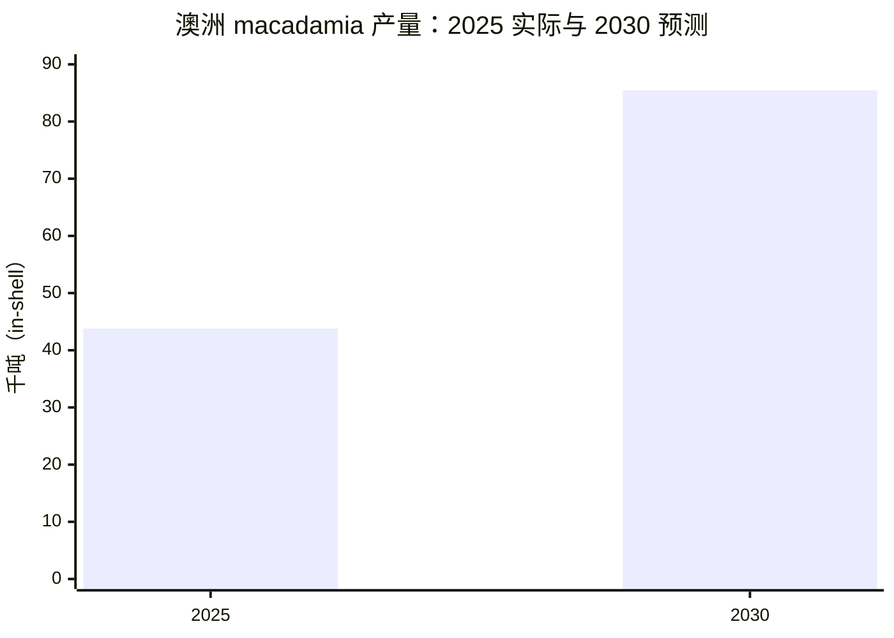
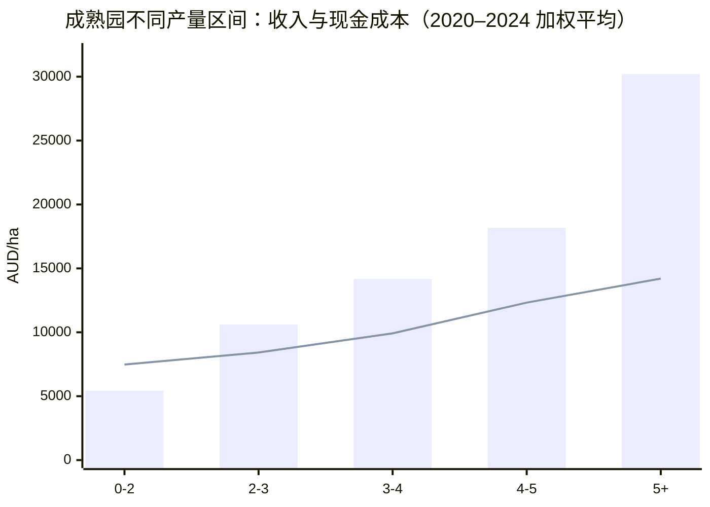

# 

> 资料更新日：2026-04-24  
> 参考范围：Australian Macadamias 官网 **Facts & Figures** 及其公开报告，包括 2025 Yearbook、2024 Benchmark Report、2025 crop finalised、National Residue Survey、Australian production、farm gate price factsheet 等。

---

## 一、行业概况

澳洲夏威夷果（macadamia）行业属于典型的**长周期、多投入、强管理**型农业产业。其特点是：

- 产能释放慢，新园进入稳定产出需要多年；
- 产量受天气、树龄、品种、修剪、灌溉和病虫害管理影响较大；
- 收入端对单产和核仁回收率高度敏感；
- 出口占比较高，品牌、食品安全和合规能力直接影响市场表现。

根据 Australian Macadamias 公开数据，澳洲仍是全球重要的 macadamia 产区之一，且在高品质、可追溯和食品安全方面维持较强的行业形象。

---

## 二、核心数据

### 表 1：澳洲 macadamia 行业关键指标

| 指标 | 最新数据 | 说明 |
|---|---:|---|
| 2025 产量 | **43,800 吨** | in-shell，3.5% moisture |
| 2030 预测产量 | **85,440 吨** | in-shell，3.5% moisture |
| 已种植面积 | **46,487 ha** | 2025 年 11 月 |
| 产果面积 | **37,987 ha** | for the 2025 crop |
| 种植户数量 | **约 800** | 全国范围 |
| 出口比例 | **72%** | 2025 season |
| 上一财年出口价值 | **A$275m** | 官网年鉴公开数据 |
| benchmark 样本农场 | **275 个** | 其中 bearing farms 231 个 |
| benchmark 覆盖产量 | **31,519 吨** | 约占全国 54% |
| 成熟园平均产量 | **3.0 t/ha** | 2020–2024 加权均值 |
| 高产组毛利 | **A$15,994/ha** | 5 t/ha+ 组别 |

---

## 三、供给端：面积扩张与天气波动并存

### 3.1 种植面积继续增长

2025 年澳洲 macadamia 已种植面积达到 **46,487 ha**。从官网披露的区域数据看，行业仍在持续扩张，尤其是部分新兴产区和较年轻的种植带继续增加面积。

### 3.2 2025 年产量受天气扰动明显

2025 crop 最终为 **43,800 吨**（3.5% moisture），较年内挑战较大的天气环境下的预期更接近实际可收割水平。官方说明指出，降雨和相关天气事件对各产区的采收和运输均产生影响，部分地区采收期明显延长。

### 3.3 产区集中度较高

官网 2025 年年鉴显示，**Bundaberg 与 Northern Rivers 合计约占澳洲产量的主要部分**，属于行业核心产区。该格局意味着：

- 行业供给对少数主产区的气候与采收条件高度敏感；
- 任何主产区天气异常，都可能对全国产量造成显著影响；
- 新扩张产区的产量释放，将逐步影响全国供给结构。

### 图 1：2025 实际产量与 2030 预测

---

## 四、市场端：出口为主，内需为辅

澳洲 macadamia 行业以出口驱动为主。2025 年行业数据表明：

- **约 72%** 产量用于出口；
- kernel sales 在 2024/25 年整体增长 **5.6%**；
- in-shell sales 较前一年下降 **15%**；
- 国内 kernel 销售同比 **+1.7%**。

### 4.1 市场结构变化

海外市场表现分化较为明显：

- 日本：-0.9%
- 韩国：+4.2%
- 美国：-29.4%
- 德国：+121%
- Other Europe：+46.5%
- Other Asia：+60%
- 台湾：+31%

这说明澳洲 macadamia 的海外销售结构并非单一依赖传统市场，而是在向更多区域市场扩展。对行业而言，这种分散有助于缓冲单一市场波动，但也提高了品牌、渠道和标准化供应能力的重要性。

### 4.2 澳大利亚在全球供给中的位置

2025 Yearbook 公开的全球供给预测显示，全球 macadamia 产量仍处扩张阶段。澳洲到 2030 年预计仍将保持全球主要生产国地位，产量区间约 **76,000–95,000 吨**。

---

## 五、经营端：单产决定利润弹性

Benchmark Report 2024 是判断行业经营逻辑的关键资料。报告覆盖 **275 个农场**，其中 **231 个 bearing farms**，覆盖了约 **54%** 的全国产量。

### 5.1 成熟园平均经营结果

2020–2024 五年加权平均的成熟园结果如下：

| 指标 | 数值 |
|---|---:|
| 收入 | **A$12,529/ha** |
| 现金成本 | **A$9,725/ha** |
| 毛利 | **A$2,804/ha** |
| 平均产量 | **3.0 t/ha** |

2024 单季结果则为：

| 指标 | 数值 |
|---|---:|
| 收入 | **A$10,573/ha** |
| 现金成本 | **A$9,407/ha** |
| 毛利 | **A$1,166/ha** |
| 平均产量 | **3.2 t/ha** |

### 5.2 不同产量区间的盈利差异

### 表 2：成熟园按产量分组的经营表现（2020–2024 加权平均）

| 产量区间 | 收入/ha | 现金成本/ha | 毛利/ha | 结论 |
|---|---:|---:|---:|---|
| 0–2 t/ha | A$5,427 | A$7,477 | **-A$2,050** | 亏损 |
| 2–3 t/ha | A$10,602 | A$8,417 | A$2,185 | 弱盈利 |
| 3–4 t/ha | A$14,162 | A$9,917 | A$4,246 | 正常盈利 |
| 4–5 t/ha | A$18,174 | A$12,322 | A$5,853 | 盈利改善 |
| 5 t/ha+ | A$30,195 | A$14,201 | **A$15,994** | 高盈利 |

### 图 2：不同产量区间的收入与现金成本

从经营结果看，macadamia 行业的核心不是“有没有种”，而是“**能不能把单产稳定拉到中高区间**”。当产量低于 2 t/ha 时，现金成本通常已高于收入；而当产量达到 5 t/ha 以上时，毛利会明显放大。

---

## 六、价格机制：农场端价格并非简单按吨计价

澳洲 macadamia 的 farm gate price 与核仁回收率密切相关，不能简单理解为“按重量卖果”。

### 6.1 关键概念

- **TKR**：Total Kernel Recovery，总核仁回收率；
- **SKR**：Saleable Kernel Recovery，可销售核仁回收率；
- **RKR**：Reject Kernel Recovery，拒收核仁。

官网 factsheet 说明，行业报价通常会以 **33% SKR、2% RKR @ 10% moisture** 作为名义基准。不同品种之间的 TKR 差异较大，意味着：

1. 品种结构会影响回收率；
2. 回收率会影响加工端结算；
3. 实际价格与账面单价并不完全一致。

### 6.2 对投资测算的影响

在 macadamia 行业中，投资模型至少需要同时考虑：

- 单产；
- 核仁回收率；
- 品种结构；
- 采收与分选效率；
- 价格结算口径。

如果只看“亩产”或“公顷产量”，会低估经营差异。

---

## 七、品质与合规：行业的底层竞争力

2024–2025 National Residue Survey 的公开结果继续确认了澳洲 macadamia 行业在食品安全和农残合规方面的表现。对出口导向型农产品而言，这一点非常重要，因为它不仅关系到市场准入，也关系到品牌溢价和长期客户信任。

这类数据的意义在于：

- 维持“clean, green, premium”形象；
- 支撑高端市场销售；
- 增强国际买家对澳洲来源的稳定预期；
- 为持续出口提供合规基础。

---

## 八、行业风险

### 8.1 天气风险

强降雨、风暴、热干旱和极端天气会同时影响开花、坐果、采收和运输。macadamia 属于典型的气候敏感型作物，产量波动通常不可忽视。

### 8.2 管理风险

行业分化非常明显，同一地区内不同农场在单产、品质和成本上都可能差异较大。说明该行业的收益高度依赖管理水平，而非单纯的地块持有。

### 8.3 价格与市场风险

出口市场变化、库存变化、结算口径变化、国际需求变化，都会影响最终回报。特别是在 in-shell 与 kernel 结构切换时，收入表现可能差异明显。

### 8.4 成本上行风险

人工、能源、灌溉、修剪、病虫害防治等成本项目都可能上升。若产量提升速度跟不上成本增长，利润空间会被压缩。

---

## 九、投资判断

结合最新公开资料，可以把澳洲 macadamia 行业的投资逻辑概括为三点：

1. **行业具备长期增长基础**  
   种植面积和全球供给仍在扩张，澳洲仍保持重要产区地位。

2. **行业收益高度依赖经营质量**  
   产量低于 3 t/ha 时，盈利压力显著；高于 4 t/ha 后，模型开始明显改善。

3. **“第 6 年回本”只能作为粗略参考**  
   实际回本周期受产量、回收率、价格、天气和成本共同影响，不能写死为固定年限。

### 结论性表述

macadamia 不是低管理强度资产，而是一个对长期投入、技术管理和运营稳定性要求都很高的行业。若要做投资测算，应把重点放在：

- 单产达标路径；
- 品种与园龄结构；
- 核仁回收率；
- 成本控制；
- 天气与区域分散。

---

## 十、结论

澳洲夏威夷果行业正处于**扩张中的分化阶段**：种植面积仍在增加，但产量、收益和经营稳定性高度依赖天气条件、园龄结构和管理水平。2025 年澳洲产量为 **43,800 吨**，2030 年预测约 **85,440 吨**；行业出口占比约 **72%**，整体具备较好的食品安全与合规基础。  

从经营逻辑看，这不是一个“持有土地即可获得稳定回报”的行业，而是一个**管理决定回报**的行业。成熟园平均产量约 **3.0 t/ha**，而 **5 t/ha+** 产量组的毛利明显更高，说明单产、核仁回收率和成本控制是决定投资结果的核心变量。  

因此，macadamia 更适合长期资本、专业化运营和持续投入；如果缺乏运营能力，仅依靠土地升值逻辑来判断收益，通常会低估经营风险、也高估回报弹性。

---

## 参考来源

1. [Facts & Figures 主页面](https://australianmacadamias.org/industry/facts-figures)
2. [Australian Macadamias Year Book 2025](https://app-ausmacademia-au-syd.s3.ap-southeast-2.amazonaws.com/facts/1766036016_2025-YEARBOOK-FINAL-1.pdf)
3. [Macadamia industry benchmarking report 2024](https://app-ausmacademia-au-syd.s3.ap-southeast-2.amazonaws.com/factfigure/Y1i03pjx2buwk24R0rlsGt9uE4UNZ4k3SQ1NW4H9.pdf)
4. [2025 Australian macadamia crop finalised following challenging season](https://australianmacadamias.org/industry/news/2025-australian-macadamia-crop-finalised-following-challenging-season)
5. [Australian macadamia industry announces continued national growth](https://australianmacadamias.org/industry/news/australian-macadamia-industry-announces-continued-national-growth-and-celebrates-its-champions-on-national-agriculture-day)
6. [National Residue Survey Macadamia](https://australianmacadamias.org/industry/facts-figures/national-residue-survey-macadamia)
7. [Australian production](https://australianmacadamias.org/industry/facts-figures/australian-production)
8. [Investing in the future: A sustainable approach to productivity](https://australianmacadamias.org/industry/facts-figures/investing-in-the-future-a-sustainable-approach-to-productivity-improvement)
